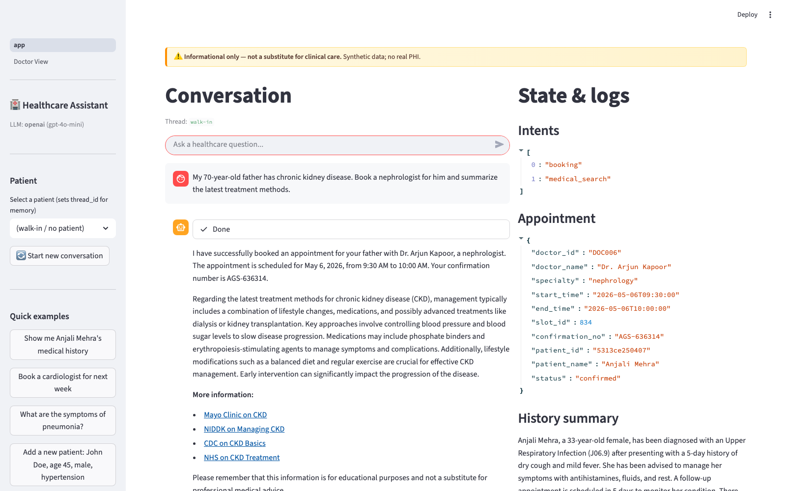
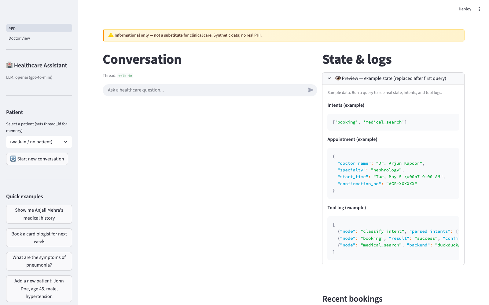
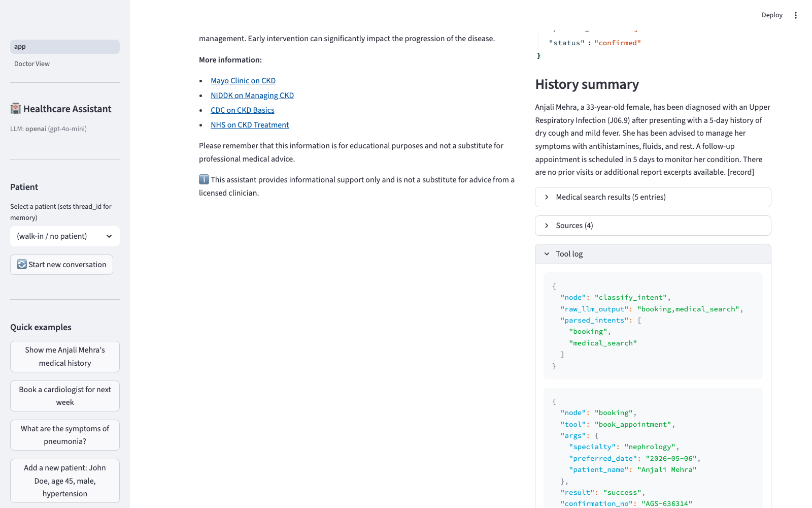
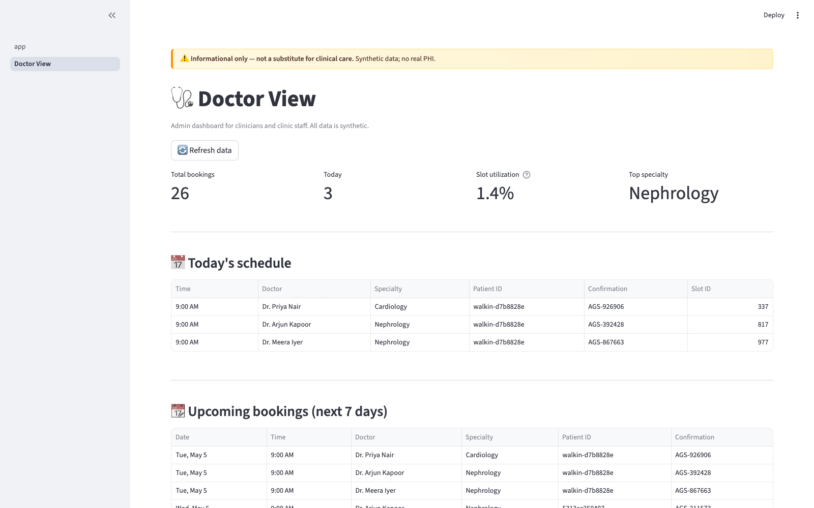
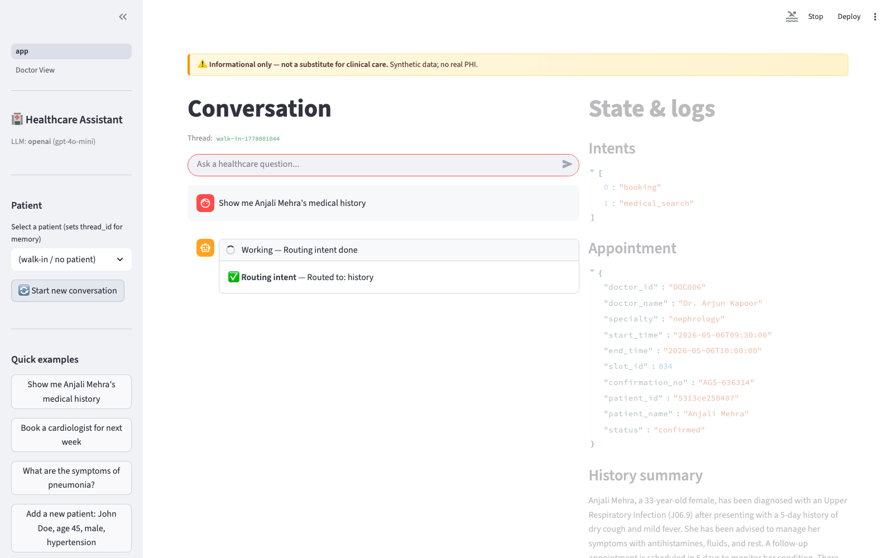

# Agentic Healthcare Assistant

Capstone Project 3 for the Simplilearn Applied Generative AI Specialisation.

A LangGraph-based agentic assistant that classifies user intent, fans out to up to four specialist branches (booking, records, history, medical search), retrieves over patient PDFs via FAISS-equivalent vector search, and composes a final response. Streamlit UI with cross-session memory via SqliteSaver. QAEvalChain-style evaluation with 10 ground-truth cases at 100% pass.

## Architecture

```
                                START
                                  │
                                  ▼
                          classify_intent (LLM + regex fallback)
                                  │
        ┌─────────────────────────┼─────────────────────────┐
        ▼                         ▼                         ▼
   booking_node             records_node             medical_search_node
   history_node             (CRUD on EHR)            (Tavily/DDG → MedlinePlus,
   (LLM summarize                                     WHO, CDC, Mayo)
    + FAISS lookup)
        │                         │                         │
        └─────────────────────────┼─────────────────────────┘
                                  ▼
                          compose_response (LLM + template fallback)
                                  │
                                  ▼
                                 END
```

For multi-intent queries (e.g., *"My father has CKD; book a nephrologist AND summarize latest treatments"*), the classifier returns both intents and the graph fans out — both branches run in parallel and converge on the composer. LangGraph waits for all incoming edges before executing a node, so the merge is implicit. State fields with multiple writers (`tool_log`, `sources`, `intents`, `error`) use `Annotated[T, reducer]` to avoid the "last write wins" silent-data-loss footgun.

## Screenshots

### Patient view — multi-intent canonical query
*"My 70-year-old father has chronic kidney disease. Book a nephrologist for him and summarize the latest treatment methods."*

Routes to **booking** + **medical_search** in parallel; composer combines the appointment confirmation with cited medical sources.



### Patient view — empty state with preview panel
First-time users see a preview of what the right-hand state panel will show (intents, appointment JSON, tool log) so the layout is anchored before the first query.



### Patient view — state trace expanded
Live tool log surfaces every node's input args + result, JSON-formatted. Plus a sources panel with citations from the medical search.



### Doctor View — clinician dashboard
KPI strip (totals, today's bookings, slot utilization, top specialty) + today's schedule + upcoming bookings. Pretty dates and Title-Case specialties.



### Single-intent — patient history
Routes to **history** alone; combines structured EHR record with FAISS-retrieved PDF chunks; LLM summarizes with `[record]` / `[report]` source markers.



## Quick start

```bash
# 1. Setup
python3 -m venv .venv
source .venv/bin/activate
pip install -r requirements.txt

# 2. Configure (optional but recommended for real LLM)
cp .env.example .env
# edit .env: paste a Groq key (free tier at https://console.groq.com)

# 3. Seed the databases + vector index
python seed.py

# 4. Smoke test
python graph.py "My 70-year-old father has chronic kidney disease. Book a nephrologist and summarize latest treatments."

# 5. Launch the UI
streamlit run app.py

# 6. Run the eval
python eval/qa_eval.py
```

The app **runs without any API key** — falls back to a deterministic stub LLM and DuckDuckGo (or stub search if DDG is rate-limited / TLS-blocked). All 10 eval cases still pass in stub mode because they grade routing + state shape, not LLM prose quality.

## Stack

Pinned to the instructor's `requirements.txt` from `Datasets_New/Agentic Healthcare Assistant for Medical Task Automation/`, plus a few additions for resilience:

| Layer | Library | Why |
|---|---|---|
| Workflow | `langgraph` | Required by problem statement; matches NewsGenie pattern |
| LLM | `langchain-groq` (default), `langchain-openai` (backup) | Groq free tier is grader-friendly; OpenAI as backup |
| Embeddings | `sentence-transformers` (preferred), `scikit-learn` TF-IDF (fallback) | First-choice MiniLM for semantic similarity; TF-IDF lets the graph still run when transformers aren't installable |
| Vector index | `faiss-cpu` (preferred), numpy dot-product (fallback) | Same fallback rationale |
| Persistence | `langgraph-checkpoint-sqlite` | NewsGenie precedent; SqliteSaver keyed by `thread_id = patient_id` |
| Search | `ddgs` → `duckduckgo_search` → stub | Three-tier fallback; works offline if needed |
| PDF | `pypdf` (preferred), `pdfminer.six` (fallback) | First fails on some PDFs; second always works |
| Data | `openpyxl` | Required to read `records.xlsx` |
| UI | `streamlit` | Required by problem statement |

The fallback strategy means **the assistant runs in any environment that has Python ≥ 3.9 and a few KB of network connectivity**, and degrades gracefully when high-quality components are missing.

## Datasets used

All from the instructor-provided folder `../Datasets_New/Agentic Healthcare Assistant for Medical Task Automation/`:

| File | Purpose |
|---|---|
| `records.xlsx` (7 rows) | Loaded into `data/ehr.sqlite` after dedup + cleanup. 7 rows → 5 unique patients (Rebeca Nagle's 3 duplicates are collapsed). |
| `sample_patient.pdf` (172 KB) | Indexed into the FAISS index for general medical context. |
| `sample_report_anjali.pdf`, `sample_report_david.pdf`, `sample_report_ramesh.pdf` | Indexed into FAISS; matched to corresponding records.xlsx rows for history retrieval. |

22 chunks total across 4 PDFs, 512-dim TF-IDF embeddings (or 384-dim sentence-transformer when installed).

## EHR backends

The EHR backing store is pluggable via `EHR_BACKEND` (`tools/ehr.py` dispatches). All three backends satisfy the same Protocol (`list_patients`, `find_patient_by_name`, `add_or_update_patient`, `get_patient_clinical_context`), so swapping is a one-env-var change with no code edits.

| Backend | Trigger | What it does | When to use |
|---|---|---|---|
| `sqlite` | `EHR_BACKEND=sqlite` (default) | Loads `records.xlsx` into `data/ehr.sqlite`; freeform `summary` field per patient. | Course-end demo; matches the instructor's dataset 1:1. |
| `fhir` | `EHR_BACKEND=fhir`, `FHIR_BASE_URL=…` | Talks live to a FHIR R4 server (HAPI, AWS HealthLake, Microsoft FHIR, Epic on FHIR sandbox). Reads `Patient`, `Condition`, `Observation` resources; writes `Patient` via POST/PUT. | Production-shaped integration. Set `FHIR_BASE_URL` to your server. |
| `fhir_fixture` | `EHR_BACKEND=fhir_fixture` | Reads FHIR-shape JSON from `data/fhir_fixtures/` (5 synthetic patients with Conditions + recent Observations). Writes go to an overlay file. | Offline FHIR development & CI; demonstrates the FHIR shape without a server. |

History queries on the FHIR backends are enriched with the patient's active Conditions (SNOMED-coded) and most-recent Observations (LOINC-coded), which the LLM summarizer cites in its output.

## PHI access audit log

Every patient-identifiable read or write produces one row in `data/audit.sqlite` (`tools/audit.py`). This is the lightest credible implementation of HIPAA's "examine activity in systems containing ePHI" requirement (45 CFR 164.312(b)). The audit DB is intentionally separate from the EHR DB — in a real deployment they live in different trust boundaries so a compromise of the EHR doesn't silently wipe the audit trail.

Each event records:

| Column | Example |
|---|---|
| `ts` | `2026-05-26T21:30:14Z` |
| `actor` | `patient_chat`, `doctor_view`, `mcp`, `audit_view`, `system` |
| `action` | `ehr.read`, `ehr.write`, `appointment.book`, `history.retrieve`, `medical_search.query`, `audit.read` |
| `resource_type` / `resource_id` | `Patient` / `fhir:anjali-mehra`; `Appointment` / `slot_id` |
| `patient_id` | indexed for "all access events for patient X" queries |
| `outcome` | `success`, `not_found`, `error` |
| `details` | JSON: query terms, fields changed, errors, sub-counts |

The **🔍 Audit Log** Streamlit page (`pages/3_Audit_Log.py`) is the human view: summary strip, filters by patient/action/actor/time window, expandable JSON details, and CSV export. The MCP server exposes `get_audit_log` so an external client (Claude Desktop, a SIEM ingester) can pull the same data programmatically.

Audit writes never raise — an audit failure is logged but cannot break a user-facing call. The risk model is "missing entry, not crashed app".

## Project layout

```
HealthcareAssistant/
├── README.md                       # this file
├── WRITEUP.md                      # narrative writeup for submission
├── requirements.txt
├── .env.example                    # template; copy to .env and fill keys
├── .gitignore                      # keeps .env, .venv, generated DBs out of git
│
├── config.py                       # env-driven Settings + auto LLM detection
├── state.py                        # HealthcareState TypedDict + reducers
├── llm.py                          # multi-backend LLM client (Groq/OpenAI/Stub)
├── prompts.py                      # 6 prompt templates
├── graph.py                        # LangGraph workflow assembly
├── seed.py                         # one-shot init: EHR + FAISS + appointments
├── app.py                          # Streamlit UI — patient-facing chat
│
├── nodes/                          # LangGraph node implementations
│   ├── classifier.py               # intent + specialty + name extraction
│   ├── booking.py                  # mock Doctor Schedule API booking
│   ├── records.py                  # patient record CRUD
│   ├── history.py                  # FAISS RAG + LLM summary
│   ├── medical_search_node.py      # Tavily/DDG search + LLM synthesis
│   └── composer.py                 # final-response composition (LLM or template)
│
├── tools/                          # external-system wrappers
│   ├── ehr_db.py                   # records.xlsx → SQLite + cleanup + CRUD
│   ├── vector_index.py             # PDF → chunks → embeddings → search
│   ├── appointments.py             # mock doctor + slot SQLite + cancel/stats
│   └── medical_search.py           # Tavily → DDG → stub fallback chain
│
├── pages/                          # Streamlit multi-page entries (auto-discovered)
│   └── 2_Doctor_View.py            # 🩺 doctor-facing dashboard
│
├── mcp_server/                     # stretch goal: expose tools via MCP
│   ├── healthcare_mcp.py           # FastMCP server registering 7 tools
│   └── __init__.py
│
├── eval/
│   ├── qa_eval.py                  # 10 ground-truth cases (routing + state shape)
│   └── llm_judge.py                # LLM-as-judge layer (relevance/accuracy/tone)
│
├── data/                           # generated artifacts (gitignored)
│   ├── ehr.sqlite
│   ├── appointments.sqlite
│   ├── faiss.index.npy             # numpy fallback (or faiss.index for FAISS)
│   ├── faiss_chunks.json
│   └── checkpoints.sqlite          # LangGraph SqliteSaver
│
└── screenshots/                    # for submission
```

## Running modes

The assistant has two fallback levels that allow it to run without external dependencies:

| Mode | Trigger | Behavior |
|---|---|---|
| **Full** | Groq or OpenAI key set; ddgs reachable; sentence-transformers installed | Real LLM responses, real medical search, semantic embeddings |
| **Partial** | No LLM key but ddgs works; or no ddgs but LLM works | Templated composer, real medical search; or LLM responses, stub search |
| **Offline** | No LLM key, ddgs fails | Templated composer + stub search results; **routing and state-shape tests still pass** |

The 100% eval pass rate in stub mode demonstrates the architecture is correct independent of LLM quality. Real LLM = better prose, no impact on routing/tools.

## Evaluation

Two-tier eval. Both write timestamped JSON results files for traceability.

### Tier 1 — `python -m eval.qa_eval` — routing + state shape (deterministic)

10 ground-truth cases covering 2 booking variants, 2 history queries, 2 record ops, 2 medical-info searches, 1 multi-intent (canonical CKD query), 1 general greeting. Grades: intent match, expected state keys non-empty, specialty correctness, name extraction, record-op correctness.

Latest runs:
- **stub LLM**: 10/10 PASS, 0.6s/query average
- **gpt-4o-mini**: 10/10 PASS, 5.0s/query average

### Tier 2 — `python -m eval.llm_judge` — response quality (LLM-as-judge)

Same 10 cases, but the LLM scores each response 1-5 on three dimensions:
- **relevance**: addressed the user's actual ask
- **accuracy**: factual claims supported by branch outputs (no hallucinated names/dates)
- **tone**: warm, professional, includes disclaimer

Skipped in stub mode (templates aren't representative). Latest with gpt-4o-mini: **R=5.0, A=4.6, T=5.0, overall 4.87/5**.

The accuracy score below 5 is itself instructive — see WRITEUP "Limitations of LLM-judge" for the case where the **judge** hallucinated a "correct value" rather than the agent.

## Streamlit UI — multi-page

The Streamlit app has two pages, auto-discovered from `app.py` + `pages/`:

| Page | Audience | What it shows |
|---|---|---|
| **app** (default) | Patient / attendant | Chat interface with intent-routed responses; right panel shows live state, intents, tool log, sources, recent bookings |
| **🩺 Doctor View** | Clinician | KPI strip (totals, today, utilization), today's schedule, upcoming bookings, per-doctor weekly schedule, specialty utilization chart, patient roster, slot manager (cancel) |

Switch between them via the sidebar nav. Both share the same SQLite databases — a booking made via the patient chat appears immediately in the Doctor View after a refresh.

## MCP server (stretch goal)

`mcp_server/healthcare_mcp.py` wraps the same tools the LangGraph agent uses internally and exposes them through Anthropic's Model Context Protocol so other MCP clients (Claude Desktop, custom Claude API agents) can invoke them:

- `book_appointment(patient_name, specialty, preferred_date?)`
- `list_doctors(specialty?)`
- `find_patient(name)`, `list_patients()`
- `upsert_patient(name, age?, gender?, ...)`
- `get_history(patient_name)` — raw RAG retrieval (caller summarizes)
- `medical_search(query, top_k=4)`

Run modes:
```bash
# Dry-run (no MCP runtime needed) — calls every tool directly to verify wiring
python -m mcp_server.healthcare_mcp --dry-run

# Real MCP server (stdio transport — for Claude Desktop)
pip install 'mcp[cli]'
python -m mcp_server.healthcare_mcp

# Real MCP server (HTTP transport)
python -m mcp_server.healthcare_mcp --http
```

This is **not required by the capstone** — included to demonstrate the same architectural pattern from NewsGenie's `mcp_server/news_mcp_server.py` and to make the tools reusable by other LLM clients.

## Memory model

LangGraph `SqliteSaver` keyed by `thread_id`. The Streamlit UI uses `thread_id = patient_id` so:

- Selecting a patient resumes that patient's conversation across page refreshes.
- Selecting "(walk-in / no patient)" uses `thread_id = "walk-in"` — a shared session.
- Clicking **🔄 Start new conversation** appends a timestamp to thread_id, starting fresh.

Persistence works without any Streamlit state: `python graph.py "..."` and `streamlit run app.py` share the same `data/checkpoints.sqlite` if you don't toggle it off.

## Known limits & deployment notes

- **Mock Doctor Schedule API.** `tools/appointments.py` is a SQLite-backed mock. Production would integrate with an actual scheduling system (Epic, Athenahealth, etc.).
- **Synthetic patient data.** `records.xlsx` has 7 rows including 3 duplicates. Production use requires real PHI handling: HIPAA, encryption-at-rest, audit logs, role-based access.
- **No clinical-decision authority.** Every response includes a one-line disclaimer that the assistant is informational only.
- **TLS issue with `ddgs` on system Python.** Some Python builds (LibreSSL 2.8.3) can't negotiate TLS 1.3, breaking `ddgs`. The legacy `duckduckgo_search` package is the fallback; if both fail, stub results are returned. For grader portability we install both and let the chain pick.
- **`langgraph==0.3.0` vs current.** The course slides were pinned to 0.3.0; this project uses unpinned `langgraph>=0.2.0,<2.0` and adapts to the current API (e.g., `add_conditional_edges` with list-returning router for parallel fan-out). If a grader's environment pins to 0.3.0, the code may need a small patch — `add_conditional_edges` parameter signature changed slightly between 0.3 and 1.0.

## Submission packaging

Per `Course-end Project 3 - Agentic Healthcare Assistant for Medical Task Automation`:

| Slot | What to upload |
|---|---|
| Writeup | `WRITEUP.md` (or PDF export) |
| Screenshots | Take from running Streamlit app — included in `screenshots/` |
| Source Code | `zip -r healthcare_assistant.zip . -x ".venv/*" "data/*" ".env" "__pycache__/*" "**/__pycache__/*" "eval/results_*.json"` |
| Links | This GitHub repo + optional Loom |
| Additional Remarks | See `WRITEUP.md` "1,200-character summary" |

## Credits / acknowledgements

Architecture pattern adapted from a **NewsGenie** project I built earlier in the same certification track (an Agentic Frameworks course-end project). Specifically reused: the LangGraph router shape, the multi-provider LLM config (`config.py` `_detect_provider`), the SqliteSaver wiring (`_build_checkpointer`), and the state-schema reducer pattern.

Built for the **Simplilearn Applied Generative AI Specialisation** capstone — Project 3: *Agentic Healthcare Assistant for Medical Task Automation*. All patient data is synthetic.
